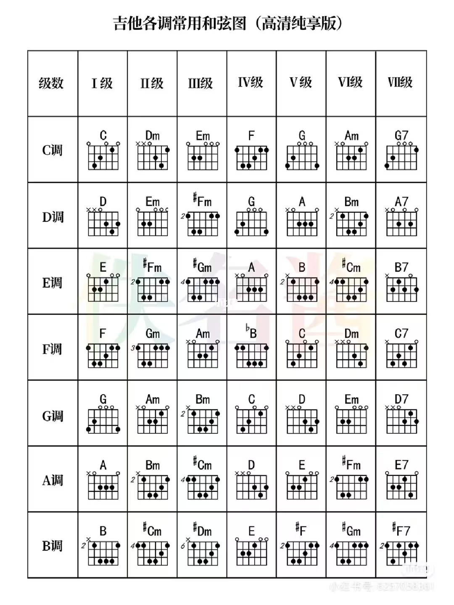

# 吉他谱

这里收集的都是我练过的吉他谱子，学乐理推荐朱家明老师的新思维吉他教学。

|   |空弦|一品|二品|三品|
|---|---|---|---|---|
|1弦|$\dot3$|$\dot4$| - |$\dot5$|
|2弦|$7$|$\dot1$| - |$\dot2$|
|3弦|$5$| - |$6$| - |
|4弦|$2$| - |$3$|$4$|
|5弦|$\mathop{6}\limits_{.}$| - |$\mathop{7}\limits_{.}$|$1$|
|6弦|$\mathop{3}\limits_{.}$|$\mathop{4}\limits_{.}$| - |$\mathop{5}\limits_{.}$|

### 常用和弦
* C和弦对应1，需要在456弦上找到1的音，则是根音
* Dm和弦对应2，需要在456弦上找到2的音，4弦空弦则是根音
* Em和弦对应3，需要在456弦上找到1的音，4弦二品则是根音
* F和弦对应4，6弦一品和4弦三品都是4，根据情况选择一个即可

### 歌曲的调
* 歌曲常见的调有C调、D调、E调、F调、G调、A调、B调，音高依次增加
* 通常C调和G调的指法好按，所以用C调G调来弹其他调(通过变调夹变调)

